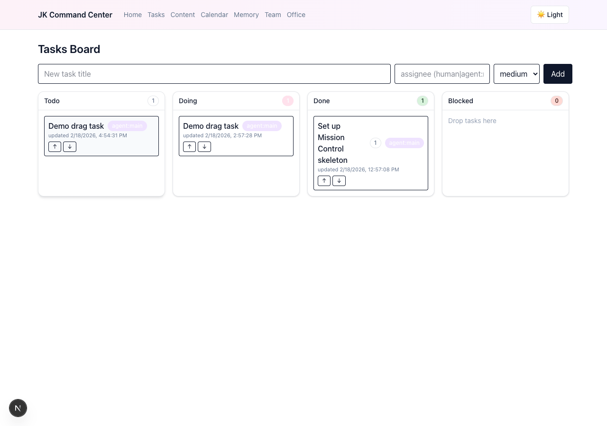
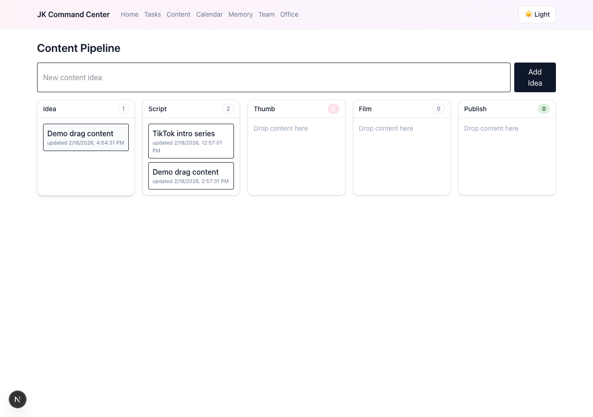
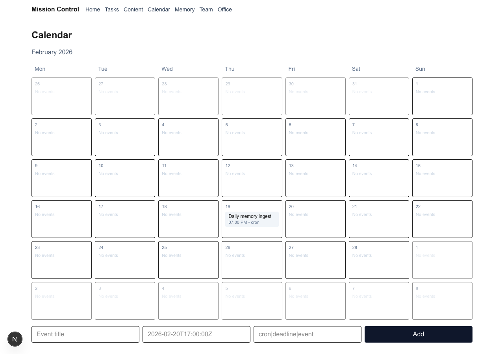

# Mission Control for OpenClaw

[](https://github.com/JK-Archivist/JK-openclaw-mission-control/actions/workflows/ci.yml)
[](LICENSE)

A plug‑and‑play Next.js dashboard that lets you see and steer your OpenClaw:
- Tasks board (agent + human tasks)
- Content pipeline (idea → script → thumb → film → publish)
- Calendar of scheduled jobs (cron + events)
- Memory screen with search (ingest your agent’s notes)
- Team (agents + subagents) and Office (live activity)

This repo ships a local‑first MVP: zero external DB, no polling, and a tiny bridge your agent calls to keep the UI in sync. You can later swap storage to Convex or any DB without changing the UI or contract.

## Features
- Next.js App Router + Tailwind UI
- Secure API (Bearer token) + Next.js Server Actions for operator edits
- File‑backed storage (JSON under `data/*.json`)
- Bridge CLI to post updates from OpenClaw (no polling)
- Drag‑and‑drop Tasks and Content columns; month calendar grid

## Requirements
- Node 18+ and npm
- OpenClaw running locally (recommended)

## Quick Start
Smoke test first:

```bash
# Once dev is running and token is set
curl -H "Authorization: Bearer $TOKEN" http://localhost:3000/api/mission/tasks/list | jq
```

1) Generate a token and write credentials for the bridge (one‑time):

```bash
TOKEN=$(openssl rand -hex 24)
mkdir -p ~/.openclaw/credentials
cat > ~/.openclaw/credentials/mission-control.json <<JSON
{
  "service": "mission-control",
  "baseUrl": "http://localhost:3000/api/mission",
  "token": "$TOKEN"
}
JSON
chmod 700 ~/.openclaw/credentials
chmod 600 ~/.openclaw/credentials/mission-control.json
```

2) Configure the app with the same token:

```bash
echo "MISSION_CONTROL_TOKEN=$TOKEN" > .env.local
```

3) Install and run:

```bash
npm install
npm run dev
# open http://localhost:3000
```

4) (Optional) Use the bridge CLI to post initial data from another terminal:

```bash
# from repo root
node skills/mission-control-bridge/bridge.mjs tasks upsert '{"title":"Kick the tires","status":"todo","assignee":"agent:main"}'
node skills/mission-control-bridge/bridge.mjs events upsert '{"title":"Daily ingest","when":"2026-02-19T02:00:00Z","kind":"cron"}'
node skills/mission-control-bridge/bridge.mjs activity update '{"agentId":"main","status":"working"}'
```

## How Mission Control stays in sync
- Your agent calls the Bridge (a tiny Node script) to POST updates to Mission Control.
- The UI uses Server Actions for operator edits (no API token in the browser).
- No polling. The agent pushes state when it changes.

Bridge credentials file (read by the CLI):

```json
~/.openclaw/credentials/mission-control.json
{ "service":"mission-control", "baseUrl":"http://localhost:3000/api/mission", "token":"<secret>" }
```

## API (stable contract)
All POSTs require `Authorization: Bearer <token>`.

- POST /api/mission/tasks/upsert → { id?, title?, description?, status: "todo|doing|done|blocked", assignee?, priority? }
- POST /api/mission/tasks/patchStatus → { id, status }
- GET  /api/mission/tasks/list

- POST /api/mission/content/upsert → { id?, idea?, title?, status: "idea|script|thumb|film|publish", script?, thumbnailUrl?, assets?[] }
- POST /api/mission/content/stage → { id, status, script?, thumbnailUrl? }
- GET  /api/mission/content/list

- POST /api/mission/events/upsert → { id?, title, when(ISO), durationMin?, kind: "cron|deadline|event" }
- GET  /api/mission/events/list

- POST /api/mission/memories/ingest → { id?, title, contentMarkdown, tags?[], sourcePath?, sessionRef? }
- GET  /api/mission/memories/list

- POST /api/mission/agents/upsert → { id?, name, role, responsibilities?[] }
- GET  /api/mission/agents/list

- POST /api/mission/subagents/upsert → { id?, parentAgentId, name, role }
- GET  /api/mission/subagents/list

- POST /api/mission/activity/update → { id?, agentId, status: "idle|working|blocked", taskRef? }
- GET  /api/mission/activity/list

Example curl:

```bash
curl -H "Authorization: Bearer $TOKEN" http://localhost:3000/api/mission/tasks/list | jq
```

## Agent integration (Bridge CLI)
The bridge is a small script your agent can call. It reads the token+baseUrl from `~/.openclaw/credentials/mission-control.json`.

```bash
# tasks
node skills/mission-control-bridge/bridge.mjs tasks upsert '{"title":"Refresh feeds","status":"doing","assignee":"agent:main"}'
node skills/mission-control-bridge/bridge.mjs tasks patchStatus '{"id":"<taskId>","status":"done"}'

# content
node skills/mission-control-bridge/bridge.mjs content upsert '{"idea":"Video: OP-03 overview","status":"idea"}'
node skills/mission-control-bridge/bridge.mjs content stage '{"id":"<id>","status":"script","script":"..."}'

# memory
node skills/mission-control-bridge/bridge.mjs memories ingest '{"title":"Heartbeat","contentMarkdown":"- checks","tags":["heartbeat"],"sourcePath":"MEMORY.md"}'

# team + activity
node skills/mission-control-bridge/bridge.mjs agents upsert '{"id":"main","name":"Agent","role":"assistant"}'
node skills/mission-control-bridge/bridge.mjs subagents upsert '{"id":"writer-1","parentAgentId":"main","name":"Writer","role":"writer"}'
node skills/mission-control-bridge/bridge.mjs activity update '{"agentId":"main","status":"working","taskRef":"<taskId>"}'
```

## Screens







- /tasks — Kanban with drag‑and‑drop and inline edits
- /content — pipeline with drag‑and‑drop, script/thumbnail editing
- /calendar — month grid with per‑day items and quick‑add form
- /memory — search + add entries (markdown)
- /team — agents and subagents management
- /office — live activity (idle/working/blocked)

## Security
- API protected via Bearer token: set `MISSION_CONTROL_TOKEN` in `.env.local`
- Keep credentials: `~/.openclaw/credentials` dir `700`, files `600`
- No secrets in client JS; Server Actions handle writes from the browser
- CORS is disabled by default (localhost); set `MISSION_CONTROL_CORS_ORIGINS` if needed

## Migrate to Convex (or any DB)
- Replace `src/lib/store.ts` with Convex mutations/queries
- Keep endpoint contracts stable → UI and bridge scripts remain unchanged
- Deploy Next.js on Vercel, Convex in the cloud; move token to Vercel env

## Troubleshooting
- 401 Unauthorized → check both `.env.local` and `~/.openclaw/credentials/mission-control.json` use the same token
- ECONNREFUSED from bridge → `npm run dev` not running or wrong `baseUrl`
- Empty screens → post seed items via the bridge; inspect `data/*.json`

## Contributing
- Issues and PRs welcome. Please avoid breaking the public API; if necessary, version endpoints.
- For new modules or features, include:
  - Unit or smoke tests if feasible
  - Documentation update (README + inline comments)

## License
MIT
